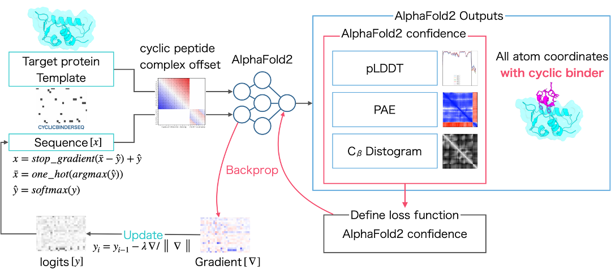
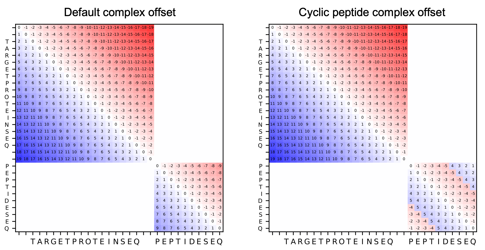

# ColabDesign for Cyclic Peptide Binder Hallucination
This repository is based on the AfDesign binder hallucination protocol from ColabDesign, published by Dr. Sergey Ovchinnikov on [GitHub](https://github.com/sokrypton/ColabDesign/tree/main/af).

Cyclic peptide complex offset was applied to AfDesign to enable hallucination of cyclic peptide binders to target proteins.

## Google Colab
Cyclic Peptide Binder Hallucination with Google Colab

Cyclic Peptide Binder Hallucination with Jupyter Notebook

[cyclic_peptide_binder_design.ipynb](https://github.com/ohuelab/ColabDesign-cyclic-binder/blob/cyc_binder/cyclic_peptide_binder_design.ipynb)

## Movie

https://github.com/ohuelab/ColabDesign-cyclic-binder/assets/7370243/a4186394-213c-4bed-98a0-381be4498003

## About Cyclic Peptide Complex Offset

Cyclic peptide complex offset is an offset for structure prediction and hallucination of protein-cyclic peptide complex.

Example of relative position encoding of a hypothetical 20-residue protein and a 10-residue peptide. Default complex offset on the left and cyclic peptide complex offset on the right.

## References

Kosugi, T.; Ohue, M. [ Design of Cyclic Peptides Targeting Protein–Protein Interactions Using AlphaFold ](https://www.mdpi.com/1422-0067/24/17/13257) _Int. J. Mol. Sci._ 2023, 24, 13257. doi:10.3390/ijms241713257

Kosugi, T.; Ohue, M. [ Design of Cyclic Peptides Targeting Protein-Protein Interactions Using AlphaFold ](https://www.biorxiv.org/content/10.1101/2023.08.20.554056) _bioRxiv_ 2023, doi:10.1101/2023.08.20.554056.
